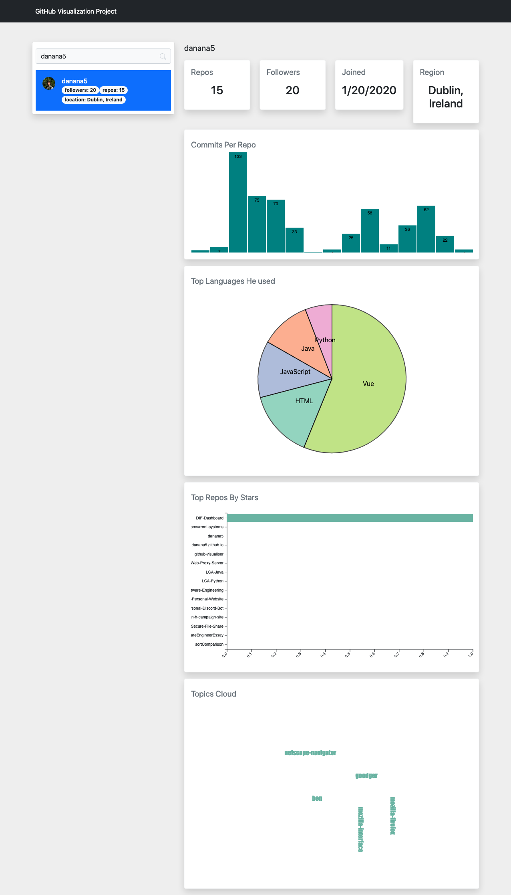

# Github-Visualization
This visualization project is created based on python, flask, bootstrap. Design pattern is MVC, front-end visualization using D3.js, front-end ajax operation using the Fetch API

### Screenshot
***

### How to run 
***
0. fill the access token in controller.py

   > TOKEN = "xxxx"

    
1. create python virtual env and install necessary package

    > pip install requirements.txt
2. run

   > python app.py

### Resources
***

- [Flask](https://flask.palletsprojects.com/en/2.0.x/)
- [Bootstrap V5](https://getbootstrap.com/)
- [PyGithub](https://github.com/PyGithub/PyGithub)
- [D3.js](https://d3js.org/)
- [D3 Exmaples](https://www.d3-graph-gallery.com/)
- [GitHub API](https://docs.github.com/en/restz)
- [Fetch API](https://developer.mozilla.org/en-US/docs/Web/API/Fetch_API)

